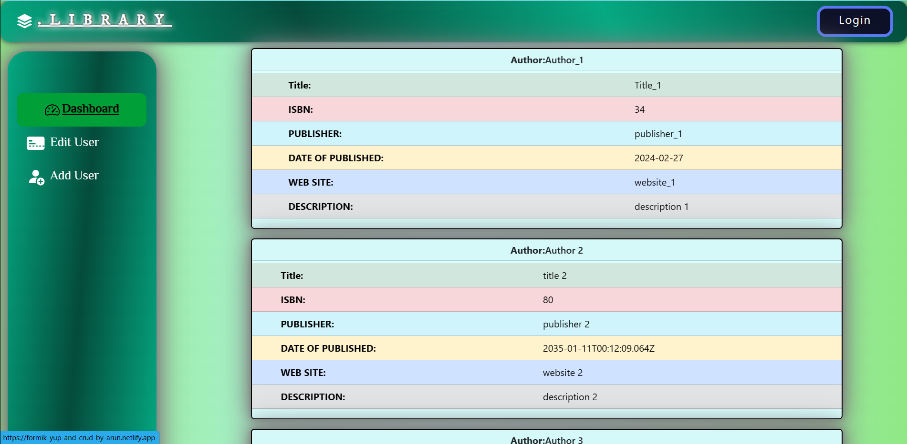
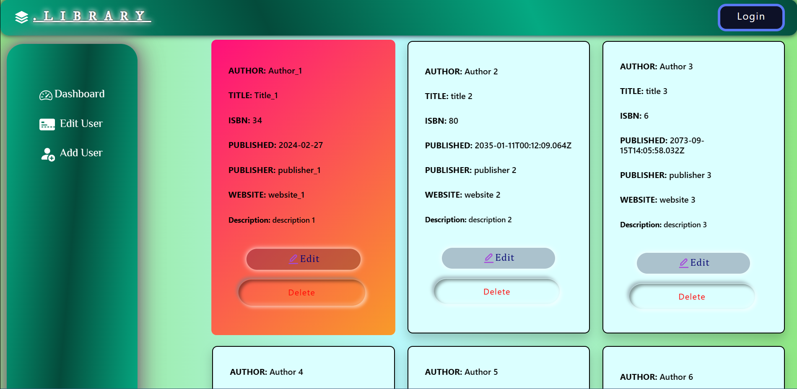
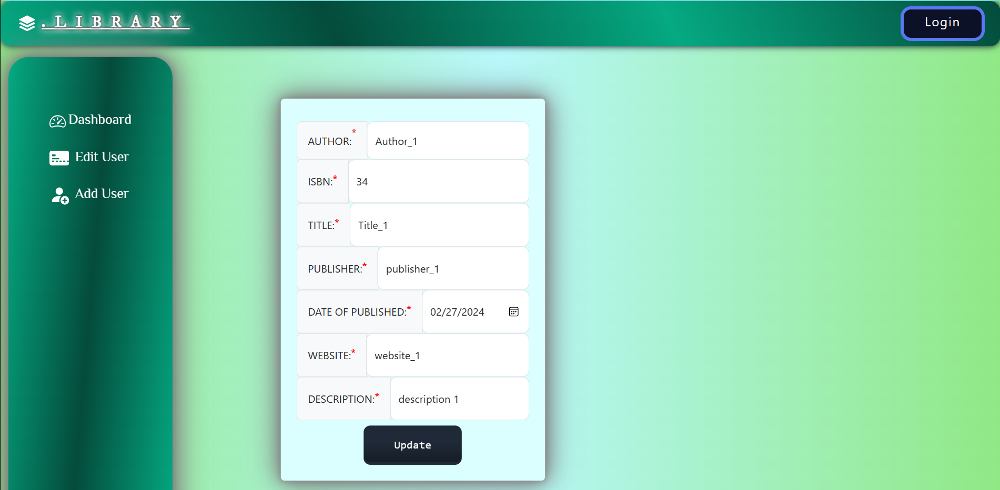

# 🎯IN THIS REPOSITORY
## 📝FORM VALIDATION WITH `FORMIK YUP` & CRUD Operation
### You can see `output` in 📍[Netlify.com](https://formik-yup-and-crud-by-arun.netlify.app/)

***Added lazy loaders directly in conditional statement*** and ***Added Login*** 
### Dashboard: (Path for example: http://localhost:5173/)

### Edit User: (Path for example: http://localhost:5173/edituser)

### Edit Form Page: (Path for example: http://localhost:5173/editform/${id})

### Add Users: (Path for example: http://localhost:5173/adduser)
.png)
### Login (Path for example: http://localhost:5173/login)
.png)
+ To install formik and yup 
```
📎 npm install formik yup 
```
+ Here i am using `axios` to fetch data from `mockapi.io`
+ To install Axios 
```
📎 npm install axios   
```
+ And please conform it in package.json at dependances
```javascript
"dependencies": {
    "axios": "^1.6.7",
    "formik": "^2.4.5",
    "react": "^18.2.0",
    "react-dom": "^18.2.0",
    "react-router-dom": "^6.22.1",
    "yup": "^1.3.3"
  }
```

